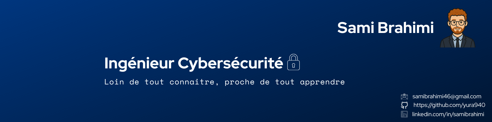

# 👋 Bonjour, je suis Sami 

🎓 Ingénieur junior en Cybersécurité — diplômé 2024 de l’ESIEE Paris.  
🔐 Passionné par la cybersécurité et ses défis techniques.  
🧠 Intéressé par l’intelligence artificielle.   
📍 Paris, France | 📫 samibrahimi46@gmail.com | [LinkedIn](https://www.linkedin.com/in/sami-brahimi/)

---

## 🛠️ Compétences principales

- **Langages** : Python, Bash, Shell, Java, JavaScript, PHP, SQL  
- **Cybersécurité** : Pentest, DevSecOps, IAM, Gestion des vulnérabilités  
- **Réseaux** : VLAN, TCP/IP, VPN, Firewall, IDS/IPS  
- **Cloud & DevOps** : Docker, Kubernetes, GitHub Actions, AWS  

---

## 🚧 Projets majeurs

Tous mes projets sont disponibles sur mon [GitHub](https://github.com/yura940).

### 🔐 [CI-Watchdog](https://github.com/yura940/ci-watchdog) — Agent DevSecOps  
Sécurisation automatisée des pipelines avec GitHub Actions.

### 🧠 [AI Password Generator](https://github.com/yura940/ai-password-generator)  
Générateur de mots de passe basé sur un modèle d'IA (transformer) entraîné avec TensorFlow.

### 🛂 [Mini IAM](https://github.com/yura940/mini-iam)  
Système de gestion des identités et des accès simplifié : gestion des rôles, tokens, politiques d’accès.

### 📦 SecuBox *(non public)*  
Solution complète de sécurisation réseau pour PME : automatisation, monitoring, portail captif, hardening Linux.

---

## 📈 En constante progression

- 💡 Formation continue en cybersécurité, cloud et IA. [Udemy | [TryHackMe](https://tryhackme.com/p/yura94) | HTB]
- 🧪 Publication régulière de projets et expérimentations sur GitHub.

---

## ❤️ Engagement humanitaire

Depuis 2019, je suis engagé dans une association humanitaire :  
- Organisation d'événements solidaires  
- Coordination de bénévoles  
- Soutien scolaire et accompagnement  
- Développement de compétences humaines : communication, gestion de projet, leadership  

Cela me permet de garder le sens du collectif et de contribuer à un impact positif au quotidien.

--- 

## 💼 En recherche d’opportunités  
Je cherche un **poste junior** en cybersécurité.  
📫 [LinkedIn](https://www.linkedin.com/in/sami-brahimi/) | samibrahimi46@gmail.com

-----------------------------------------------------------------------------------------------------------------

# 👋 Hi, I'm Sami

🎓 Junior Cybersecurity Engineer — graduating in 2024 from ESIEE Paris.  
🔐 Passionate about cybersecurity and its technical challenges.  
🧠 Interested in artificial intelligence and its applications.  
📍 Paris, France | 📫 samibrahimi46@gmail.com | [LinkedIn](https://www.linkedin.com/in/sami-brahimi/)

---

## 🛠️ Core Skills

- **Languages**: Python, Bash, Shell, Java, JavaScript, PHP, SQL  
- **Cybersecurity**: Pentesting, DevSecOps (CI/CD), Vulnerability management  
- **Networking**: VLAN, TCP/IP, VPN, Firewall, IDS/IPS  
- **Cloud & DevOps**: Docker, Kubernetes, GitHub Actions, AWS  

---

## 🚧 Key Projects

All of my projects are available on my [GitHub profile](https://github.com/yura940).

### 🔐 [CI-Watchdog](https://github.com/yura940/ci-watchdog) — DevSecOps Agent  
Automated security for CI/CD pipelines using GitHub Actions.

### 🧠 [AI Password Generator](https://github.com/yura940/ai-password-generator)  
Password generator based on a transformer AI model trained with TensorFlow.

### 🛂 [Mini IAM](https://github.com/yura940/mini-iam)  
Lightweight Identity and Access Management system: roles, tokens, and access policies.

### 📦 SecuBox *(not public)*  
Complete network security solution for SMEs: automation, monitoring, captive portal, and Linux hardening.

---

## 📈 Continuous Learning

- 💡 Ongoing training in cybersecurity, cloud, and AI.[Udemy | [TryHackMe](https://tryhackme.com/p/yura94) | HTB]
- 🧪 Regularly publishing projects and experiments on GitHub.

---

## ❤️ Humanitarian Commitment

Since 2019, I’ve been involved in a humanitarian association:  
- Organizing charitable events  
- Coordinating volunteer teams  
- Providing academic support  
- Building strong soft skills: communication, leadership, project management  

It helps me stay grounded, team-oriented, and motivated to make a positive impact.
---

## 💼 Open to Opportunities  
I'm currently looking for a **junior position** in cybersecurity.  
📫 [LinkedIn](https://www.linkedin.com/in/sami-brahimi/) | samibrahimi46@gmail.com

